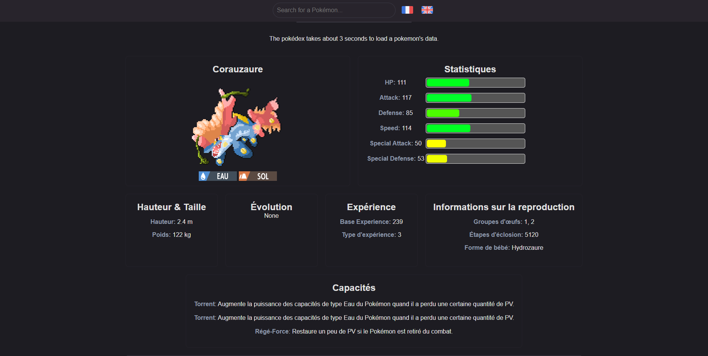
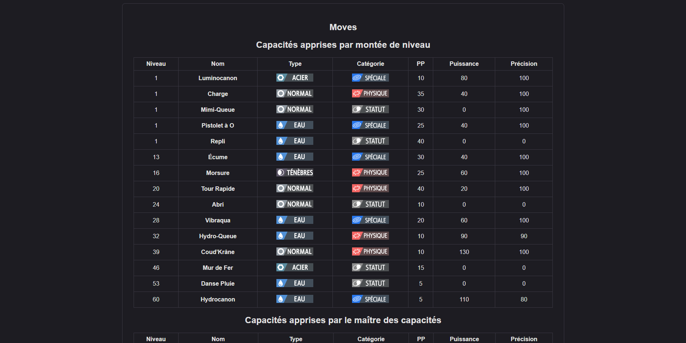

# Pokemon Studio To Web Pokedex
This is a tool to build a web-based pokédex of your pokémon fangame (based on psdk), in just 5 minutes!
You just need to copy and paste some files/folders, rename some of them, and you'll get a web version of Pokémon Studio, ready to be used by your players.

⚠️There is a bit of delay, because it's on GitHub and doesn't have really high perfomances. Takes about 3 seconds to load a pokemon's data.⚠️

## Check out the Pokédex from [Pokémon Impotia](https://pokemon-impotia.github.io) that uses this repository!

## How to make a GitHub Pages Website
You need to make a repository named after this format: `{the_username_of_your_github_account}.github.io`.
If you did not understand, check out GitHub's documentation: [GitHub Pages](https://pages.github.com/)

## Requirements
- All IMGs must be .PNGs
- All your sprites in the pokefront folder must be in full lowercase, containing only the name of the pokemon. For example, "Bidoof.png" must be "bidoof.png".
- These names must be the exact same as the ones in the national.json file.

## How to setup:
1. Copy the folders `moves`, `abilities`, `pokemon` located at `FANGAME_ROOT_FOLDER\Data\Studio` to the root of this folder.
   
2. Copy the file `national.json` located at `FANGAME_ROOT_FOLDER\Data\Studio\dex` to the root of this folder, **and rename it as pokedex.json**
   (or the regional pokedex if you want. Take the file you want to be displayed on the pokedex webpage, it's built to handle only one json.)
   
3. Copy the files `100004.csv`, `100005.csv`, `100006.csv` located at `FANGAME_ROOT_FOLDER\Data\Text\Dialogs` to the folder csv.
   
4. Copy the folder `pokefront` located at `FANGAME_ROOT_FOLDER\graphics\pokedex` to the root of this folder.

5. Run the file `upscale_sprites` to upscale your fakemon sprites by 4 times the current size (preferably from VS Code).

After GitHub does its checks (might take some time), your website should be up and running!

## Contribute to the project
What you can do using PSDK's info:
- Make a move searcher (would be useful to display custom moves info).
- Add info where to find a pokemon in the fangame.
- Add info listing directly all the pokemon groups that are can spawn on certain locations (clearer explanation: be able to see what pokemons spawn in a certain zone like Route 1).
- Add fakemon's description
- Develop the explanation concerning Experience Groups, Experience Types, etc...

### Please, credit me for the Pokédex. I put a credit in the footer, you can move it but don't forget to credit me :)
